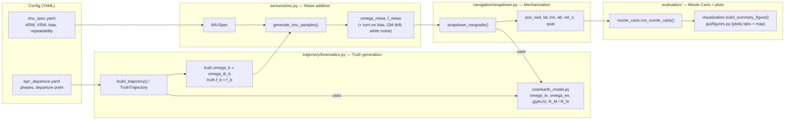

# ins_sim

**Inertial Navigation Simulation & GUI** — an open-source 6-DOF, WGS-84
strapdown INS Monte Carlo simulator with a PySide6 desktop front end.

[Documentation](https://jorgieo.github.io/ins_sim/) ·
[Latest release](https://github.com/jorgieo/ins_sim/releases/latest) ·
[MIT License](LICENSE)

## Overview

`ins_sim` generates a truth flight trajectory, derives the gyro and
accelerometer outputs a perfect IMU would produce along that trajectory
(`ω_ib_b`, `f_b`), corrupts them with a navigation-grade IMU error model
(angular/velocity random walk, Gauss-Markov bias drift, turn-on bias
repeatability), and runs a strapdown mechanization to recover position,
velocity, and attitude. A Monte Carlo ensemble over independent noise
realizations characterizes how navigation error grows over time for a given
IMU grade.

The simulation models rotating-Earth effects explicitly: Earth rate, transport
(craft) rate, WGS-84 radii of curvature, and Somigliana normal gravity are all
evaluated at the current latitude/altitude at every step, so the strapdown
mechanization is consistent with true inertial navigation rather than a flat,
non-rotating Earth approximation. The vertical channel runs either baro-damped
(third-order fixed-gain loop) or free-inertial, where it exhibits the expected
instability.

Results are explored in a desktop GUI whose visualizations are fully
interactive plotly pages rendered in-app.

## Download

Prebuilt portable bundles for **Windows** and **Linux** are attached to every
[GitHub Release](https://github.com/jorgieo/ins_sim/releases/latest) — no
Python installation required:

- `ins_sim-vX.Y.Z-windows-x86_64.zip` — extract, then run `ins_sim.exe`
  inside the extracted folder.
- `ins_sim-vX.Y.Z-linux-x86_64.tar.gz` — `tar xzf`, then run
  `./ins_sim/ins_sim`.

See the [Download & Install](https://jorgieo.github.io/ins_sim/download/)
page for platform notes (Windows SmartScreen, Linux runtime libraries).

## The GUI

Launch from source with:

```bash
pip install ".[gui]"
python -m ins_sim.gui
```

- Select a mission trajectory and IMU error specification (packaged YAMLs or
  your own files with the same schema).
- Set the trial count, integration time step, and baro altitude aiding
  (uncheck it to run the vertical channel free-inertial).
- Run the Monte Carlo ensemble in the background with live log output.
- Explore the results in interactive plotly tabs:
  - **CEP** — horizontal error growth for every trial, ensemble CEP, linear
    fit, and a percentile table by hour.
  - **Attitude / Velocity / Position errors** — ensemble mean and 3σ bands
    per axis.
  - **3D Trajectory** — all trial tracks, the truth track, and a 95th
    percentile error tube.
  - **Map** — ground track over OpenStreetMap tiles with a horizontal error
    envelope (map tiles are the only feature that needs an internet
    connection).

## CLI

A scripted run of the same engine (20-trial ensemble, matplotlib summary
figure, standalone ground-track map HTML):

```bash
pip install -e ".[dev]"
python main.py
```

To use a different mission profile or IMU grade, point `build_trajectory` /
`load_imu_spec` at your own YAML files (same schema as the defaults):

```python
from ins_sim.trajectory.kinematics import build_trajectory
from ins_sim.sensors.imu import load_imu_spec

truth, v_sprint, R_turn = build_trajectory("path/to/your_mission.yaml", dt=0.1)
spec = load_imu_spec("path/to/your_imu_spec.yaml")
```

## Architecture

Data flows from truth generation, through noise injection, into the strapdown
navigator, and is summarized by the Monte Carlo / evaluation layer:



## Conventions

**Frames**
- **NED (n-frame)** — local-level North-East-Down navigation frame, origin at
  the current position. Position is reported relative to the trajectory start
  unless otherwise integrated as geodetic (lat, lon, alt).
- **Body (b-frame)** — vehicle-fixed frame: x forward, y right, z down.
- Rotating-Earth quantities (Earth rate `ω_ie`, transport rate `ω_en`) are
  evaluated in NED and resolved into body via `C_n^b` where needed.

**Attitude**
- Attitude is propagated and stored as a **scalar-last quaternion**
  `[x, y, z, w]` (`scipy.spatial.transform.Rotation` convention), representing
  the body-to-NED rotation `C_b^n`.
- Euler angles, when used (e.g. for plotting), are `[roll φ, pitch θ, heading ψ]`
  applied in body axis order `Z-Y-X` (heading, then pitch, then roll).

**Units — strict SI**
- Angles: radians (`rad`), angular rates: `rad/s`.
- Length: meters (`m`), velocity: `m/s`, acceleration/specific force: `m/s²`.
- Time: seconds (`s`).
- YAML mission/IMU configs are expressed in conventional datasheet/aviation
  units (`deg`, `kt`, `ft`, `°/hr`, `µg`, etc.) and are converted to SI at load
  time (`build_trajectory`, `load_imu_spec`) — no non-SI unit crosses into the
  simulation core.

## Development

```bash
# Editable install with dev dependencies
pip install -e ".[dev,gui]"

# Test suite
python -m pytest

# Local desktop bundle (onedir, at dist/ins_sim/)
pyinstaller ins_sim.spec --noconfirm

# Documentation site (http://127.0.0.1:8000)
pip install ".[docs]"
mkdocs serve
```

Releases are automated: pushing a `v*` tag triggers the
[release pipeline](.github/workflows/release.yml), which builds the Windows
and Linux bundles, smoke-tests each frozen app with a real simulation run,
and publishes them to a GitHub Release. Pushing a `release/*` branch performs
the same build as a dry run (workflow artifacts, no release). The
[docs workflow](.github/workflows/docs.yml) deploys the documentation site to
GitHub Pages on every push to `main`.

## License

This project is licensed under the [MIT License](LICENSE).
