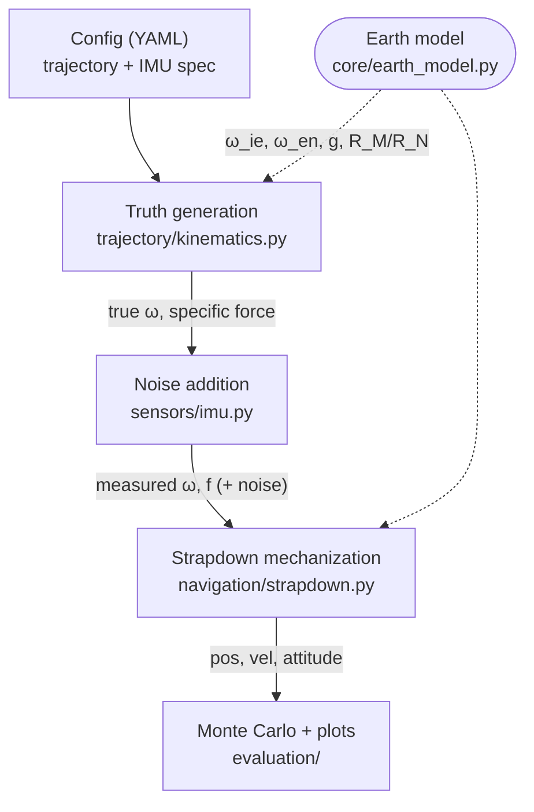

# Inertial Navigation Simulation & GUI

`ins_sim` is an open-source **6-DOF, WGS-84 strapdown INS Monte Carlo
simulator** with a desktop GUI. It generates a truth flight trajectory,
derives the gyro and accelerometer outputs a perfect IMU would produce along
it, corrupts them with a navigation-grade IMU error model, and runs a
strapdown mechanization to recover position, velocity, and attitude. A Monte
Carlo ensemble over independent noise realizations characterizes how
navigation error grows over time for a given IMU grade.

[Download the app](download.md){ .md-button .md-button--primary }
[View on GitHub](https://github.com/jorgieo/ins_sim){ .md-button }

## Core features

- **Truth trajectory generation** from YAML mission profiles — waypoint legs,
  speed ramps, climbs, and turns, specified in conventional aviation units and
  converted to strict SI internally.
- **Navigation-grade IMU error model**: angular/velocity random walk,
  Gauss-Markov bias drift, and turn-on bias repeatability, parameterized by a
  YAML datasheet spec.
- **Rotating-Earth strapdown mechanization**: Earth rate, transport rate,
  WGS-84 radii of curvature, and Somigliana normal gravity evaluated at the
  current latitude/altitude every step — not a flat-Earth approximation.
- **Vertical channel physics**: a third-order baro-damped loop by default, or
  free-inertial mode to observe the channel's inherent instability.
- **Monte Carlo evaluation**: ensembles of independent noise realizations with
  CEP, per-axis error bands, and percentile statistics.
- **Interactive visualizations** — every tab is a plotly page rendered in-app:
  CEP growth with a percentile table, attitude/velocity/position 3σ bands, a
  3D trajectory with a 95th percentile error tube, and a ground-track map.

## Architecture

Data flows from truth generation, through noise injection, into the strapdown
navigator, and is summarized by the Monte Carlo / evaluation layer:

## Conventions in brief

- **Frames**: local-level North-East-Down navigation frame (n) and a
  vehicle-fixed body frame (b: x forward, y right, z down).
- **Attitude**: scalar-last quaternion `[x, y, z, w]` representing the
  body-to-NED rotation, per the `scipy.spatial.transform.Rotation` convention.
- **Units**: strict SI inside the simulation core; YAML configs use
  conventional datasheet/aviation units (`deg`, `kt`, `ft`, `°/hr`, `µg`) and
  are converted at load time.

## Where next

- [Download & Install](download.md) — grab the prebuilt app for Windows
  (x86-64) or Linux (x86-64 / ARM64, including Raspberry Pi 4/5 on 64-bit OS).
- [User Guide](guide.md) — configuring missions and reading the results.
- [Theory & Math](theory.md) — the formulations behind the simulator.
