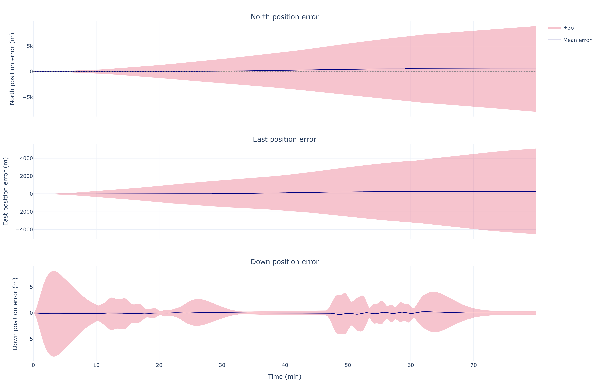
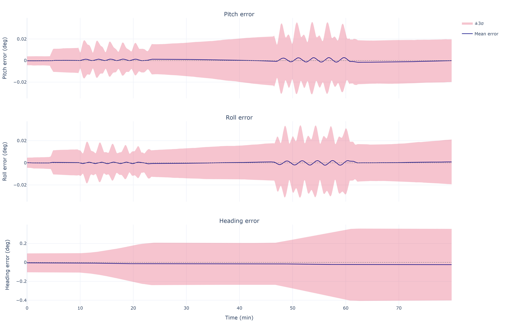

# Theory & Math

This page documents the physics and mathematics **as implemented** in the
simulator, with pointers to the modules that carry each formulation. Symbols:
geodetic latitude \(\phi\), longitude \(\lambda\), altitude \(h\); NED
navigation frame \(n\); body frame \(b\); body-to-NED rotation
\(\mathbf{C}_b^n\).

## WGS-84 Earth model

*Module: `ins_sim/core/earth_model.py`*

| Constant | Symbol | Value |
| -------- | ------ | ----- |
| Semi-major axis | \(a\) | 6 378 137.0 m |
| Flattening | \(f\) | 1 / 298.257223563 |
| First eccentricity² | \(e^2 = f(2-f)\) | 6.694379990e−3 |
| Earth rotation rate | \(\omega_{ie}\) | 7.2921151467e−5 rad/s |

The radii of curvature at latitude \(\phi\):

$$
R_N = \frac{a}{\sqrt{1 - e^2\sin^2\phi}},
\qquad
R_M = \frac{a\,(1 - e^2)}{\left(1 - e^2\sin^2\phi\right)^{3/2}}
$$

where \(R_N\) (prime-vertical) governs east-west motion and \(R_M\)
(meridian) governs north-south motion.

Earth rate and transport (craft) rate resolved in NED, both evaluated at the
current state on every integration step:

$$
\boldsymbol{\omega}_{ie}^n =
\begin{bmatrix} \omega_{ie}\cos\phi \\ 0 \\ -\omega_{ie}\sin\phi \end{bmatrix},
\qquad
\boldsymbol{\omega}_{en}^n =
\begin{bmatrix}
  \dfrac{v_E}{R_N + h} \\[2ex]
  \dfrac{-v_N}{R_M + h} \\[2ex]
  \dfrac{-v_E\tan\phi}{R_N + h}
\end{bmatrix}
$$

## Gravity

Normal gravity on the ellipsoid follows the Somigliana formula,

$$
g_0(\phi) = g_e\,\frac{1 + k\sin^2\phi}{\sqrt{1 - e^2\sin^2\phi}},
\qquad
g_e = 9.7803253359~\text{m/s}^2,\quad k = 1.93185265241\times10^{-3},
$$

with a **linear free-air altitude correction** as implemented:

$$
g(\phi, h) = g_0(\phi)\left(1 - \frac{2h}{a}\right)
$$

This first-order correction (\(\partial g/\partial h \approx -2g/a\)) is
accurate to about 1 µg below 10 km — well under the navigation-grade
accelerometer bias — so the higher-order \(f\), \(m\), and \(h^2\) terms of
the full formula are deliberately omitted. The local gravity vector is
\(\mathbf{g}^n = [0,\, 0,\, +g(\phi,h)]^T\) (Down positive).

## Strapdown mechanization

*Module: `ins_sim/navigation/strapdown.py` (`strapdown_navgrade`)*

The mechanization integrates the classic NED navigation equations. In
continuous form:

$$
\dot{\mathbf{C}}_b^n = \mathbf{C}_b^n\,\boldsymbol{\Omega}_{ib}^b
                     - \boldsymbol{\Omega}_{in}^n\,\mathbf{C}_b^n,
\qquad
\boldsymbol{\Omega} = [\boldsymbol{\omega}\times]
$$

$$
\dot{\mathbf{v}}^n = \mathbf{C}_b^n\,\mathbf{f}^b
  - \left(2\boldsymbol{\omega}_{ie}^n + \boldsymbol{\omega}_{en}^n\right)
    \times \mathbf{v}^n + \mathbf{g}^n
$$

$$
\dot{\phi} = \frac{v_N}{R_M + h}, \qquad
\dot{\lambda} = \frac{v_E}{(R_N + h)\cos\phi}, \qquad
\dot{h} = -v_D
$$

Discretely, each step \(k \to k+1\) performs:

1. Evaluate \(\boldsymbol{\omega}_{ie}^n\), \(\boldsymbol{\omega}_{en}^n\),
   and \(g(\phi,h)\) at the current state.
2. Form the body rate relative to the navigation frame:
   \(\boldsymbol{\omega}_{nb}^b =
   \boldsymbol{\omega}_{ib}^b -
   \mathbf{C}_n^b\left(\boldsymbol{\omega}_{ie}^n +
   \boldsymbol{\omega}_{en}^n\right)\).
3. **Attitude** — advance by the *exact* rotation-vector exponential rather
   than a first-order DCM update: the implementation stores attitude as a
   scalar-last quaternion and right-multiplies by
   \(\exp\!\left([\boldsymbol{\omega}_{nb}^b\,\Delta t\,\times]\right)\), which
   is exactly the solution of the DCM differential equation above for a
   constant rate over the step.
4. Resolve specific force into NED: \(\mathbf{f}^n = \mathbf{C}_b^n\mathbf{f}^b\).
5. **Velocity** — forward-Euler step of the velocity equation, including the
   Coriolis term \(\left(2\boldsymbol{\omega}_{ie}^n +
   \boldsymbol{\omega}_{en}^n\right)\times\mathbf{v}^n\).
6. **Position** — forward-Euler step of the geodetic rates.

The forward-Euler scheme is chosen deliberately to match the truth-side IMU
derivation: feeding the truth \(\boldsymbol{\omega}_{ib}^b, \mathbf{f}^b\)
back through the mechanization reproduces the truth trajectory (the
zero-noise self-consistency check in `main.py`).

## IMU stochastic error model

*Module: `ins_sim/sensors/imu.py` (`generate_imu_samples`)*

Each sensor triad's measurement is, per axis:

$$
\tilde{\mathbf{y}}_k = (\mathbf{I} + \mathbf{M})\,\mathbf{y}_k
  + \mathbf{b}_{r} + \mathbf{b}_{d,k} + \boldsymbol{\eta}_k
$$

| Term | Model | Drawn |
| ---- | ----- | ----- |
| \(\mathbf{M}\) | Scale factor on the diagonal, six independent misalignment angles off-diagonal | once per trial |
| \(\mathbf{b}_r\) | Turn-on bias repeatability, \(\mathcal{N}(0, \sigma_{BR}^2)\) | once per trial |
| \(\mathbf{b}_{d,k}\) | Bias instability: first-order Gauss-Markov | every sample |
| \(\boldsymbol{\eta}_k\) | ARW/VRW white noise | every sample |

The Gauss-Markov drift uses the exact discrete AR(1) form, which keeps the
steady-state variance \(\sigma_{BI}^2\) independent of the sample rate:

$$
b_{k+1} = a\,b_k + \sqrt{1 - a^2}\,\sigma_{BI}\,w_k,
\qquad a = e^{-\Delta t/\tau}
$$

The white-noise standard deviation per sample is \(\sigma_\eta =
\mathrm{ARW}/\sqrt{\Delta t}\) (VRW for the accelerometer), which makes the
integrated angle (velocity) uncertainty grow as \(\mathrm{ARW}\cdot\sqrt{t}\)
independent of the sample rate.

Each trial also draws an **initial-alignment error**: NED tilt and azimuth
misalignments applied to the truth attitude,
\(\mathbf{R}_0 = \exp([\boldsymbol{\delta}\times])\,\mathbf{R}_{0,\text{true}}\)
with \(\boldsymbol{\delta} = [\delta_N, \delta_E, \delta_D]\). Physically the
tilts are limited by accelerometer bias over \(g\) and the azimuth by the
gyrocompass limit, east-gyro bias over \(\omega_{ie}\cos\phi\).

## INS error dynamics

### Schuler oscillation

Horizontal position/velocity/tilt errors are coupled through gravity and the
Earth's curvature into the Schuler loop: a tilt error \(\delta\theta\)
misresolves gravity into horizontal acceleration \(g\,\delta\theta\), while
the resulting position error re-tilts the computed local level by
\(\delta p / R\). The result is a bounded oscillation with

$$
\omega_s = \sqrt{\frac{g}{R}},
\qquad
T_s = 2\pi\sqrt{\frac{R}{g}} \approx 84.4~\text{min}
$$

visible as the dominant period in the North/East error channels:

### Vertical channel { #vertical-channel }

The vertical channel is **unstable** in a free-inertial mechanization.
Perturbing the altitude equation through the free-air gravity gradient gives

$$
\delta\ddot{h} \approx \frac{2g}{R}\,\delta h + \delta a_D
\quad\Longrightarrow\quad
\lambda = \pm\sqrt{\frac{2g}{R}},
$$

an exponential divergence with e-folding time \(\sqrt{R/2g} \approx 570\) s
(≈9.5 min). Uncheck *Baro altitude aiding* in the GUI to observe it.

With aiding enabled, the INS-minus-baro altitude residual drives a
**third-order damping loop** acting on altitude, vertical velocity, and an
integral state that absorbs steady vertical accelerometer error:

$$
K_1 = \frac{3}{\tau}, \qquad
K_2 = \frac{3}{\tau^2}, \qquad
K_3 = \frac{1}{\tau^3}
$$

which places a triple pole at \(s = -1/\tau\) — characteristic polynomial
\((s + 1/\tau)^3\) — with \(\tau = 100\) s by default: well-damped, no
residual oscillation, and steady accelerometer bias rejected by the
integrator.

## Monte Carlo error characterization

*Module: `ins_sim/evaluation/monte_carlo.py`*

The simulator characterizes navigation error **empirically**: \(N\)
independent trials each draw their own turn-on biases, scale
factor/misalignment matrices, Gauss-Markov histories, white-noise streams,
and initial-alignment error, run the full nonlinear mechanization, and the
ensemble is summarized statistically:

- **±3σ bands** (attitude/velocity/position tabs): the pointwise ensemble
  mean and standard deviation of each error component — the diagonal of the
  empirical covariance

$$
\mathbf{P}_{\text{emp}}(t) = \frac{1}{N-1}\sum_{i=1}^{N}
  \left[\mathbf{x}_i(t) - \bar{\mathbf{x}}(t)\right]
  \left[\mathbf{x}_i(t) - \bar{\mathbf{x}}(t)\right]^T
$$

- **Percentile envelopes**: the pointwise \(q\)-th percentile of radial error
  across trials — the 95th percentile drives the 3D error tube and the map
  envelope.
- **CEP** (Circular Error Probable): the pointwise 50th percentile of
  *horizontal* radial error, with a linear drift-rate fit over the first
  hour.

Ensemble statistics converge as \(1/\sqrt{N}\); the tails (95th percentile)
converge more slowly than the median, so CEP stabilizes at lower trial
counts than the error tube.

!!! note "Not a linearized covariance analysis"
    The simulator propagates **no** linearized error-state model — there is
    no 15-state \(\dot{\delta\mathbf{x}} = \mathbf{F}\delta\mathbf{x} +
    \mathbf{G}\mathbf{w}\) system or analytic covariance in the codebase.
    Every statistic above comes from full nonlinear Monte Carlo trials.
    Implementing the linearized model (and eventually Kalman-filter-based
    aiding, e.g. GNSS/INS) and validating it against these empirical bounds
    is natural future work.
